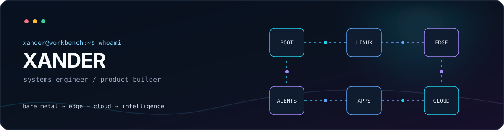

  

  
  

  I build complete products across the stack: <b>bootloader → Linux → device services → cloud → apps → AI agents</b>. 
  I architect and implement software for complex robots and consumer Linux products, including device services, cloud platforms, clients, calibration and factory tools, provisioning, OTA and mass-production workflows.

  
<b>中文简介</b>

   
  我是 Xander，一名偏系统方向的全栈工程师，负责复杂机器人与消费级 Linux 产品的软件架构设计和代码实现。完整做过设备端、云端、桌面与移动客户端、标定和产线工具、设备初始化、OTA 以及量产软件流程。

## Stack map

<table>
  <tr>
    <td width="50%" valign="top">
      <h3>🤖 Robotics &amp; Linux Device Architecture</h3>
      <code>C++20</code> <code>ROS Noetic</code> <code>Linux</code> <code>Sensor HAL</code> <code>Device Services</code>  
      Sensor and subsystem boundaries · camera / IMU / audio integration · hardware abstraction layers · timestamp synchronization · V4L2 · ALSA · Rockchip MPP / RGA / RKAIQ · BlueZ · D-Bus
    </td>
    <td width="50%" valign="top">
      <h3>☁️ Backend &amp; Device Cloud</h3>
      <code>Go</code> <code>MQTT</code> <code>gRPC</code> <code>JSON-RPC</code> <code>WebSocket</code>  
      Concurrent services · fleet and device lifecycle · remote diagnostics · OTA orchestration · Ent / Atlas · PostgreSQL / SQLite · Redis · AWS S3 · Nginx
    </td>
  </tr>
  <tr>
    <td width="50%" valign="top">
      <h3>🖥️ Clients, Factory &amp; Product Engineering</h3>
      <code>TypeScript</code> <code>Vue 3</code> <code>React 19</code> <code>React Native</code>  
      Desktop and mobile clients · calibration workstations · flashing and provisioning · production-line tools · Electron · Tauri / Rust · Expo · native IPC · serial / BLE tooling
    </td>
    <td width="50%" valign="top">
      <h3>🧠 AI, Delivery &amp; Operations</h3>
      <code>MCP</code> <code>ADK Go</code> <code>RAG</code> <code>Docker</code> <code>GitHub Actions</code>  
      Grounded agents · vector retrieval · multi-agent workflows · U-Boot · Device Tree · systemd · A/B OTA · packaging · cross-compilation · deployment · diagnostics
    </td>
  </tr>
</table>

  

## Selected work

<table>
  <tr>
    <td width="50%" valign="top">
      <h3><a href="https://github.com/coder-xander/xanderPool">xanderPool</a></h3>
      Header-only C++20 work-stealing thread pool with priority scheduling and structured concurrency.  
      <code>C++20</code> <code>work stealing</code> <code>lock-free</code>
    </td>
    <td width="50%" valign="top">
      <h3><a href="https://github.com/coder-xander/api_panel">api_panel</a></h3>
      Cross-platform dashboard for tracking balance and usage across multiple AI API providers.  
      <code>Electron</code> <code>Vue 3</code> <code>Gridstack</code> <code>IPC</code>
    </td>
  </tr>
</table>

  Also contributing to <a href="https://github.com/NousResearch/hermes-agent">Hermes Agent</a>: sessions, configuration and CLI infrastructure.

<!-- LATEST_PRS_START -->

### 📬 Latest Pull Requests

Currently **1** open PR(s) authored by [coder-xander](https://github.com/coder-xander).

<!-- LATEST_PRS_END -->

## Contribution signal

  <picture>
    <source media="(prefers-color-scheme: dark)" srcset="https://raw.githubusercontent.com/coder-xander/coder-xander/output/github-contribution-grid-snake-dark.svg">
    
  </picture>

<code>ship · measure · debug · repeat</code>

